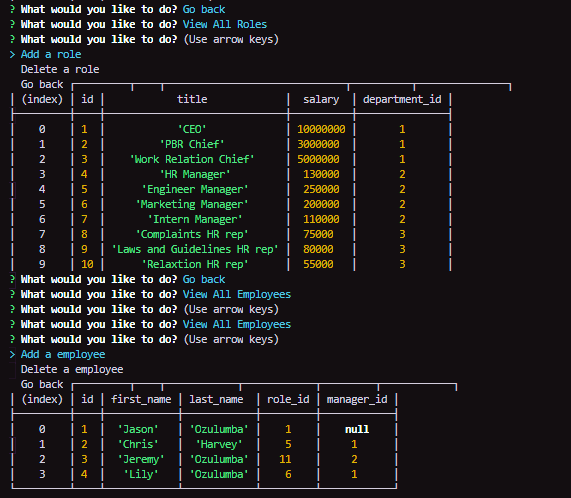

# Don't-Cook-The-Books

## Description

  

  High level overview of a company with the abilty to veiw/add departments, roles and employees

  

  ## Table of Contents
  
  * [Installation](#installation)
  * [Usage](#uasge)
  * [License](#license)
  * [Contributing](#contributing)
  * [Tests](#tests)
  * [Questions](#questions)
  
  ## Installation

  * Clone repo into a directory of your choosing.
  * Run "npm install" in your terminal while you are located your directory.
  * Run "npm start" or "node app.js" in your terminal.

  ## Usage

  Its CLI node app you must have node installed in your system to use and terminal to get/set data

  ## License

  

  ## Contributing

  None

  ## Tests

  None

  ## Questions

  * To contact me for any additional questions:
    
    * My GitHub username is MBPJason
    * The link to my page is [here](https://www.github.com/MBPJason)
    * To email me my email is cjozulumba@gmail.com
